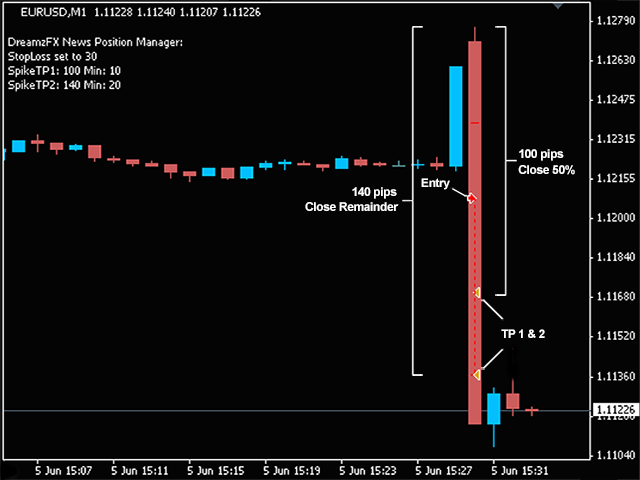

# MT4 News Trade Manager
Manages your trades during news spikes on the Metatrader 4 trading platform.

## Settings

- **BreakEven:**
Move stop loss to lock-in profit price.

- **BreakEvenPips:**
Pips in profit to reach before setting a BreakEven.

- **BreakEvenProfit:**
Profit in pips to set the BreakEven.

- **AutoStopLoss:**
Initial Stop Loss.

- **AutoTakeProfit:**
Initial Take Profit.

- **TP1:**
Close half the position once desired profit in pips has been reached (this is just a normal Take Profit 1).

- **SpikeTP1:**
Take Profit 1 relative to the 1M candle (if TP1 is also set, whichever comes first will be triggered).

- **SpikeTP1Min:**
Minimum pips to guarantee before partial closure.

- **SpikeTP2:**
Set the Take Profit relative to the 1M candle.

- **SpikeTP2Min:**
Minimum pips to guarantee for Take Profit.

## How SpikeTP works
If you straddle the news or use a clicker, this Trade Manager can close your position based on the expected spike. For instance, if you think a Non-Farm Payroll release may produce a 100pip spike, and set "SpikeTP2" to 95 and "SpikeTP2Min" to 5, then take profit will be set at the 95pip price, regardless of entry price. If you were filled at 90pips, your position will be closed with 5 pips profit. If you're filled at 80pips, then you bank 15pips profit. If you get filled at 100pips, then it will wait until you have the minimum amount of profit, which in this case is 5pips, and then close the position.

Here is the same example using absolute prices: the spike is from 1.1000 to 1.1100 (100 pips), your take profit will be set at 1.1095 regardless of entry price, but will guarantee at least 5 pips profit. If you were filled at 1.1095, it will close at 1.1100.
